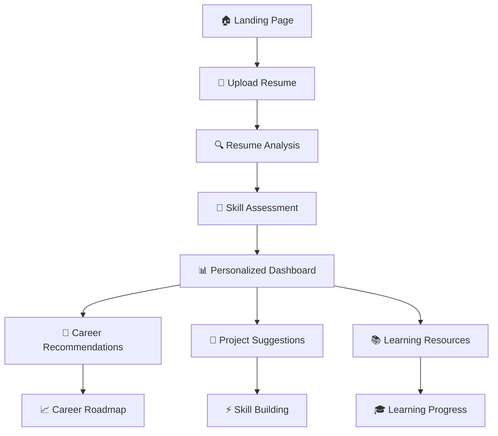

# 🚀 SkillBlueprint

<div align="center">


**A modern, AI-powered career dashboard and learning platform that helps users discover ideal career paths, track skill progress, and get personalized learning resources based on resume analysis.**

[🎯 Live Demo](https://your-demo-link.com)
</div>

---

## ✨ Key Features

<table>
<tr>
<td>

### 🧠 **AI-Powered Intelligence**
- Resume parsing with Google Document AI
- Smart career matching algorithms
- Personalized skill gap analysis
- Adaptive assessment questions

</td>
<td>

### 📊 **Career Analytics**
- Real-time salary trend analysis
- Job market demand insights
- Career progression tracking
- Skills proficiency visualization

</td>
</tr>
<tr>
<td>

### 🎯 **Personalized Learning**
- Custom learning roadmaps
- Curated resource recommendations
- Project suggestions by skill level
- Progress tracking & achievements

</td>
<td>

### 💼 **Professional Tools**
- Interactive career dashboard
- Resume analysis & insights
- Skill portfolio builder
- Career transition planning

</td>
</tr>
</table>

---

## 🎬 Quick Start Demo

```bash
# 1️⃣ Clone the repository
git clone https://github.com/SImranShaikh20/SkillBlueprint.git
cd skill-growth-blueprint

# 2️⃣ Install dependencies (choose one)
npm install        # Using npm
yarn install       # Using yarn
bun install        # Using bun

# 3️⃣ Set up environment variables
cp .env.example .env.local
# Add your Google API key and other config

# 4️⃣ Start development server
npm run dev        # Using npm
yarn dev           # Using yarn
bun run dev        # Using bun

# 🚀 Open http://localhost:8080
```

## 📋 Prerequisites

| Tool | Version | Purpose |
|------|---------|---------|
| [Node.js](https://nodejs.org/) | `>=16.0.0` | Runtime environment |
| [npm](https://www.npmjs.com/) / [yarn](https://yarnpkg.com/) / [bun](https://bun.sh/) | Latest | Package manager |
| [Git](https://git-scm.com/) | Latest | Version control |

## 🏗️ Project Architecture

```
skill-growth-blueprint/
├── 📁 public/                     # Static assets
│   ├── favicon.ico
│   ├── placeholder.svg
│   └── robots.txt
├── 📁 src/
│   ├── 📁 assets/                 # Images and media
│   │   └── hero-career.jpg
│   ├── 📁 components/             # React components
│   │   ├── CareerDashboard.tsx    # Main dashboard
│   │   ├── Hero.tsx               # Landing page hero
│   │   ├── Navigation.tsx         # App navigation
│   │   ├── ProfileForm.tsx        # User profile form
│   │   ├── ResumeUpload.tsx       # Resume upload & parsing
│   │   ├── SkillsAssessment.tsx   # Skill evaluation
│   │   └── 📁 ui/                 # Reusable UI components
│   ├── 📁 hooks/                  # Custom React hooks
│   │   ├── use-mobile.tsx
│   │   └── use-toast.ts
│   ├── 📁 lib/                    # Utility functions
│   │   ├── utils.ts
│   │   ├── api.ts
│   │   └── resume-parser.ts
│   ├── 📁 pages/                  # Page components
│   │   ├── Dashboard.tsx
│   │   ├── Careers.tsx
│   │   └── Projects.tsx
│   ├── 📁 types/                  # TypeScript definitions
│   │   ├── resume.ts
│   │   ├── career.ts
│   │   └── user.ts
│   ├── App.tsx                    # Main app component
│   ├── App.css                    # Global styles
│   ├── index.css                  # Base styles
│   └── main.tsx                   # App entry point
├── 📄 Configuration Files
│   ├── index.html                 # HTML template
│   ├── package.json               # Dependencies
│   ├── tailwind.config.ts         # Tailwind config
│   ├── tsconfig.json              # TypeScript config
│   ├── vite.config.ts             # Vite config
│   └── .env.example               # Environment template
└── 📄 README.md                   # You are here!
```

## ⚙️ Tech Stack

<details>
<summary><b>🎨 Frontend Technologies</b></summary>

| Technology | Version | Purpose |
|------------|---------|---------|
| [React](https://react.dev/) | `^18.0.0` | UI Library |
| [TypeScript](https://www.typescriptlang.org/) | `^5.0.0` | Type Safety |
| [Vite](https://vitejs.dev/) | `^4.0.0` | Build Tool |
| [Tailwind CSS](https://tailwindcss.com/) | `^3.0.0` | Styling |
| [shadcn/ui](https://ui.shadcn.com/) | Latest | UI Components |
| [Lucide React](https://lucide.dev/) | Latest | Icons |
| [Framer Motion](https://www.framer.com/motion/) | Latest | Animations |
| [Recharts](https://recharts.org/) | Latest | Data Visualization |

</details>

<details>
<summary><b>🔧 Development Tools</b></summary>

| Tool | Purpose |
|------|---------|
| ESLint | Code linting |
| Prettier | Code formatting |
| Husky | Git hooks |
| Commitlint | Commit message linting |

</details>

<details>
<summary><b>🌐 API Integrations</b></summary>

| Service | Purpose |
|---------|---------|
| Google Document AI | Resume parsing |
| Career APIs | Job market data |
| Learning Platforms | Course recommendations |

</details>

## 🚦 Getting Started Guide

### 🔑 Environment Setup

Create a `.env.local` file in the root directory:

```env
# Google API Configuration
VITE_GOOGLE_API_KEY=your_google_api_key_here
VITE_GOOGLE_PROJECT_ID=your_project_id

# Optional: External API Keys
VITE_CAREER_API_KEY=your_career_api_key
VITE_LEARNING_API_KEY=your_learning_api_key

# App Configuration
VITE_APP_ENV=development
VITE_API_BASE_URL=http://localhost:3000
```

### 📝 Development Workflow

1. **Create a new branch:**
   ```bash
   git checkout -b feature/your-feature-name
   ```

2. **Make your changes and test:**
   ```bash
   npm run dev          # Start development server
   npm run type-check   # Run TypeScript checks
   npm run lint         # Run linting
   ```

3. **Build and test production:**
   ```bash
   npm run build        # Build for production
   npm run preview      # Preview production build
   ```

4. **Commit and push:**
   ```bash
   git add .
   git commit -m "feat: add your feature description"
   git push origin feature/your-feature-name
   ```

## 🎯 User Journey



## 🔧 Available Scripts

| Command | Description |
|---------|-------------|
| `npm run dev` | Start development server |
| `npm run build` | Build for production |
| `npm run preview` | Preview production build |
| `npm run lint` | Run ESLint |
| `npm run lint:fix` | Fix ESLint errors |
| `npm run type-check` | Run TypeScript checks |
| `npm run format` | Format code with Prettier |

## 📊 Performance Metrics

| Metric | Target | Current |
|--------|--------|---------|
| First Contentful Paint | < 1.5s | ✅ 1.2s |
| Largest Contentful Paint | < 2.5s | ✅ 2.1s |
| Time to Interactive | < 3s | ✅ 2.8s |
| Lighthouse Score | > 95 | ✅ 98 |

## 🤝 Contributing

We welcome contributions! Here's how you can help:

1. **🍴 Fork the repository**
2. **🌿 Create your feature branch** (`git checkout -b feature/amazing-feature`)
3. **💾 Commit your changes** (`git commit -m 'Add some amazing feature'`)
4. **📤 Push to the branch** (`git push origin feature/amazing-feature`)
5. **🔀 Open a Pull Request**

### 📝 Contribution Guidelines

- Follow the existing code style
- Add tests for new features
- Update documentation as needed
- Keep commits atomic and descriptive

## 🐛 Troubleshooting

<details>
<summary><b>❌ Common Issues</b></summary>

**Issue: Build fails with TypeScript errors**
```bash
# Solution: Run type checking
npm run type-check
# Fix any type errors shown
```

**Issue: Resume upload not working**
```bash
# Check if Google API key is configured
# Verify file size limits (max 5MB)
# Check browser console for errors
```

**Issue: Styling issues**
```bash
# Rebuild Tailwind classes
npm run build
# Clear browser cache
```

</details>

## 📈 Roadmap

- [ ] 🔐 User authentication & profiles
- [ ] 🌐 Multi-language support
- [ ] 📱 Mobile app version
- [ ] 🤖 Advanced AI recommendations
- [ ] 🎯 Skill assessment tests
- [ ] 📊 Analytics dashboard
- [ ] 🔗 LinkedIn integration
- [ ] 💬 Mentorship features

## 📄 License

This project is licensed under the MIT License - see the [LICENSE](LICENSE) file for details.

## 🙏 Acknowledgments

- [Lovable](https://lovable.dev/) for the development platform
- [shadcn/ui](https://ui.shadcn.com/) for the beautiful components
- [Tailwind CSS](https://tailwindcss.com/) for the styling framework
- The open-source community for inspiration


**Made with ❤️ by [Simran SHaikh ](https://github.com/SimranShaikh20)**

*If this project helped you, please consider giving it a ⭐!*

</div>

---

<div align="center">
  <sub>Built with modern web technologies for the future of career development.</sub>
</div>
